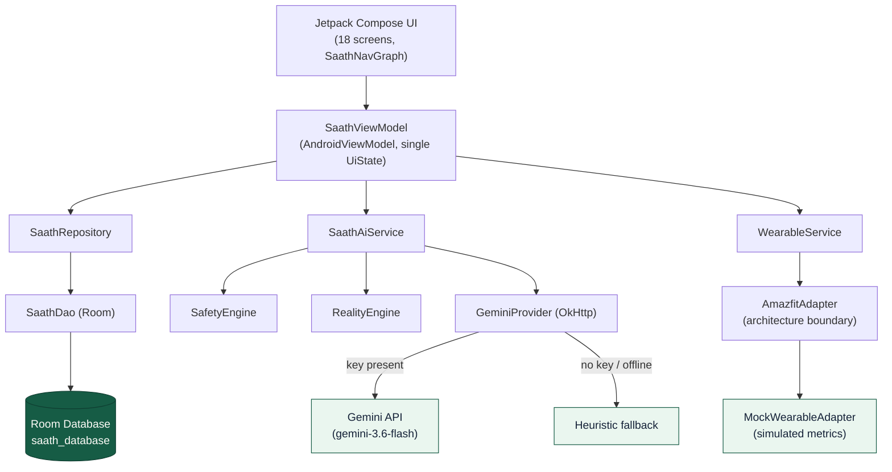

<div align="center">


# SAATH
### *"Always with you."*

**An AI companion that helps you understand how you feel, decide what to do next, and stay connected to the people who matter.**

[](#-feature-matrix)
[](#-tech-stack)
[](#-tech-stack)
[](#-tech-stack)
[](#-tech-stack)
[](#-tech-stack)
[](#-tech-stack)
[](#-tech-stack)

**[ Overview ](#-what-is-saath)** · **[ Core Experience ](#-core-experience)** · **[ Screens ](#-screen-map)** · **[ Features ](#-feature-matrix)** · **[ Architecture ](#-architecture)** · **[ Getting Started ](#-getting-started)**

</div>

<br/>

> **A note on scope.** SAATH is a wellbeing companion, not a diagnostic or therapeutic tool. It never diagnoses conditions or replaces a licensed therapist — it helps with everyday check-ins, planning, and staying connected to real support.

<br/>

---

## 💚 What is SAATH?

SAATH is a 24×7 AI companion that blends **emotional check-ins**, **AI conversation**, **daily planning**, **task breakdown**, **wellness exercises**, **focus sessions**, **trusted human support**, and **wellbeing insights** into one calm daily flow.

<div align="center">

```
   FEEL   →   UNDERSTAND   →   RESET   →   PLAN   →   ACT   →   CONNECT   →   REFLECT
```

</div>

The product philosophy is simple: **name what you feel → break it into something doable → do the smallest next step → don't carry it alone.** SAATH is designed to feel like a friend, a mentor, and a daily planner in one — never a clinician.

<br/>

---

## 🌀 The Problem

<div align="center">

</div>

Pressure builds → we escape into distraction → tasks get avoided → they accumulate → we get overwhelmed → which creates more pressure. **SAATH is built to interrupt this loop early** — with a check-in, a broken-down task, or a 2-minute reset, before the spiral compounds.

<br/>

---

## 🧭 Core Experience

```mermaid
flowchart LR
    A[Morning Check-in] --> B[Saathi understands context]
    B --> C[Daily Plan generated]
    C --> D[Smart Task Breakdown]
    D --> E[2-Minute Reset]
    E --> F[Focus Session]
    F --> G[Trusted Circle]
    G --> H[Journal & Reflect]
    H -.tomorrow.-> A

    style A fill:#EAF6EF,stroke:#165C45,color:#152238
    style B fill:#EAF6EF,stroke:#165C45,color:#152238
    style C fill:#EAF6EF,stroke:#165C45,color:#152238
    style D fill:#165C45,stroke:#0E3D30,color:#FCFBF7
    style E fill:#EAF6EF,stroke:#165C45,color:#152238
    style F fill:#EAF6EF,stroke:#165C45,color:#152238
    style G fill:#EAF6EF,stroke:#165C45,color:#152238
    style H fill:#165C45,stroke:#0E3D30,color:#FCFBF7
```



Every step runs through the same intelligence layer: a **Safety Engine** screens for crisis language first; a **Reality Engine** turns whatever's overwhelming you into a concrete 3-step plan; and **Saathi** (your AI companion) carries the conversation, backed by Gemini with an offline-safe heuristic fallback.

<br/>

---

## 📱 Screen Map

There's no `assets/screens/` folder with captured screenshots in this repository yet, so here is an honest map of every screen that's actually wired into `SaathNavGraph.kt` — 18 destinations across 5 groups.

<details open>
<summary><b>🔐 Auth</b></summary>

| Screen | What it does |
|---|---|
| **Login** | Email/password UI, pre-filled demo credentials, "Skip for now" |
| **Sign Up** | Registration UI → routes into Onboarding |

</details>

<details open>
<summary><b>🌱 Onboarding & Planning</b></summary>

| Screen | What it does |
|---|---|
| **Onboarding** | Name, age group, goals, and Saathi's name/avatar/voice/personality/language |
| **Morning Check-in** | Mood, stress (0–10), and today's priorities |
| **Daily Plan** | AI-generated schedule from your check-in priorities, ready to accept |

</details>

<details open>
<summary><b>🎯 Core</b></summary>

| Screen | What it does |
|---|---|
| **Home** | Mood + stress summary, today's tasks, wearable snapshot, quick actions |
| **Saathi Chat** | Conversational companion with suggestion chips and inline actions |
| **Tasks** | Full task list, add/complete/delete |
| **Task Detail** | Subtasks, "break this down with AI," start focus |
| **Focus Session** | Countdown timer with play / pause / reset |
| **2-Minute Reset** | Guided breathing exercise with phase + cycle tracking |

</details>

<details open>
<summary><b>🤝 Support</b></summary>

| Screen | What it does |
|---|---|
| **Circle** | Trusted contacts list |
| **Add / Manage Contact** | Add a trusted contact with relation, phone, email |
| **Support Request** | Prepare a support ask; call/SMS via native Android intents |
| **Safety** | Crisis resources, grounding shortcut, "reach my Circle" |

</details>

<details open>
<summary><b>📊 Insights</b></summary>

| Screen | What it does |
|---|---|
| **Journal** | Mood, "what helped" tags, free-text reflection |
| **Insights** | Weekly/overview mood & activity visualizations |
| **Settings** | Profile, Saathi config, wearable sync, reset demo data |

</details>

<br/>

---

## ✅ Feature Matrix

Status reflects what's actually implemented in this repository, not the product roadmap.

| Feature | Status | Implementation |
|---|:---:|---|
| **AI Companion (Saathi Chat)** | ✅ Implemented | `SaathAiService` — Gemini REST call with heuristic fallback, mirrored in Kotlin & JS |
| **Reality Engine** (stressor → task breakdown) | ✅ Implemented | Keyword-classified stressor → 3-step action plan, in `AiEngine.kt` and `aiService.js` |
| **Safety Engine** (crisis screening) | ✅ Implemented | Keyword screening → India-specific 24/7 helplines (Tele-MANAS, KIRAN, Vandrevala, AASRA, 112) |
| **Morning Check-in → Daily Plan** | ✅ Implemented | `CheckInScreens.kt` + `generateDailyPlanSuggestions()` |
| **Task Management** (tasks, subtasks, detail) | ✅ Implemented | Room-backed `Task` entity with `subtasksJson`, full CRUD |
| **2-Minute Reset** (breathing exercise) | ✅ Implemented | Phased timer (inhale/hold/exhale) with cycle count |
| **Focus Session** (Pomodoro-style) | ✅ Implemented | Countdown with play/pause/reset, logs a `FocusSession` |
| **Trusted Circle** | ✅ Implemented | Contacts + **real native call/SMS intents** (`ACTION_DIAL`, `ACTION_SENDTO`) |
| **Journal & Reflection** | ✅ Implemented | Room-backed `JournalEntry` with mood + "what helped" tags |
| **Demo Mode** (90-second guided walkthrough) | ✅ Implemented | `run90SecondDemo()` auto-drives check-in → plan → chat → reset → focus |
| **Insights dashboard** | 🟡 Partial | Full UI (`InsightsScreen.kt`, 369 lines) but not yet wired to real check-in/journal history — currently self-contained |
| **Smart Nudges** | 🟡 Partial | `generateSmartNudge()` (Kotlin) and `nudgeManager.js` (web) produce contextual text; no Android push/notification channel is wired up |
| **Firebase (AI / App Check)** | 🟡 Partial | Declared as Gradle dependencies (`firebase-ai`, `firebase-appcheck`); actual chat path bypasses them and calls the Gemini REST endpoint directly |
| **Wearable Layer** (Amazfit / band) | 🔵 Demo / Mock | `AmazfitAdapter` is a real architecture boundary, but it wraps `MockWearableAdapter`, which returns simulated HR/sleep/steps. No BLE/Zepp integration yet |
| **Authentication** | 🔵 Demo / Mock | Login/Sign Up are local UI only, pre-filled with demo credentials; no backend auth is wired (Firebase Auth is present but commented out in Gradle) |
| **Web Browser Preview** | ✅ Implemented | Full React 18 + Vite mirror of the same 18 screens and AI logic, in-memory state |

<br/>

---

## 🏗 Architecture

<div align="center">

</div>

**Android — MVVM + Repository, confirmed from source:**



**Web preview (React + Vite)** mirrors the same product language in JavaScript: `App.jsx` (~2,700 lines, all 18 screens as one component tree), `services/aiService.js` (Safety + Reality Engine equivalents, same Gemini REST call), and `services/nudgeManager.js`. It keeps state in memory rather than in a database — it's a fast preview surface, not a persistence layer.

<br/>

---

## 🗂 Repository Structure

```text
SAATH/
├── app/                                  # Android app module
│   └── src/
│       ├── main/
│       │   ├── java/com/example/
│       │   │   ├── MainActivity.kt
│       │   │   ├── ai/AiEngine.kt              # SaathAiService, SafetyEngine, RealityEngine, GeminiProvider
│       │   │   ├── wearable/WearableService.kt # WearableService, AmazfitAdapter, MockWearableAdapter
│       │   │   ├── data/
│       │   │   │   ├── local/SaathDao.kt
│       │   │   │   ├── local/SaathDatabase.kt  # Room DB + demo data seeding
│       │   │   │   ├── model/Entities.kt       # 10 Room entities
│       │   │   │   └── repository/SaathRepository.kt
│       │   │   └── ui/
│       │   │       ├── SaathViewModel.kt
│       │   │       ├── navigation/SaathNavGraph.kt   # 18 destinations + Demo Mode runner
│       │   │       ├── screens/                      # Auth, CheckIn, Circle, Home, Insights,
│       │   │       │                                  # Onboarding, SaathiChat, Safety/Settings,
│       │   │       │                                  # Tasks, Wellness
│       │   │       ├── components/                    # CommonWidgets, DemoModeBanner, NavigationBars, SaathiAvatar
│       │   │       └── theme/                          # Color.kt, Theme.kt, Type.kt
│       │   ├── res/
│       │   └── AndroidManifest.xml
│       ├── androidTest/
│       └── test/                          # Robolectric + Roborazzi screenshot tests
│   └── build.gradle.kts
│
├── src/                                    # React + Vite web preview
│   ├── App.jsx                             # all screens, single component tree
│   ├── main.jsx
│   ├── index.css
│   ├── components/                         # DemoModeBanner.jsx, SaathiAvatar.jsx
│   └── services/                           # aiService.js, nudgeManager.js
│
├── assets/readme/                          # visual assets for this README
├── build.gradle.kts
├── settings.gradle.kts
├── gradle/libs.versions.toml
├── package.json
├── vite.config.js
├── metadata.json
├── .env.example
└── README.md
```

<br/>

---

## 🛠 Tech Stack

<table>
<tr>
<td valign="top" width="50%">

**Android**
- Kotlin `2.2.10`, AGP `9.1.1`, Gradle `9.3.1`
- Jetpack Compose · Material 3
- Navigation Compose `2.8.9`
- Room `2.7.0` (KSP codegen)
- Retrofit `2.12.0` + OkHttp + Moshi
- Kotlin Coroutines & Flow
- Robolectric + Roborazzi (unit / screenshot tests)
- `compileSdk 36` · `minSdk 24` · `targetSdk 36`

</td>
<td valign="top" width="50%">

**AI, Data & Web**
- Gemini API (`gemini-3.6-flash`) via direct REST call
- Heuristic Safety Engine & Reality Engine (India crisis helplines)
- Room-backed local persistence, 10 entities, demo-seeded
- React `18.3` + Vite `6.1` browser preview
- `lucide-react` icon set
- Firebase AI / App Check declared (not yet wired into the chat path)

</td>
</tr>
</table>

<br/>

---

## 🚀 Getting Started

<details>
<summary><b>Android app</b></summary>

```bash
# from the repo root
./gradlew assembleDebug
# or open in Android Studio and run on an emulator / device (minSdk 24)
```

To enable live Gemini responses (optional — the app falls back to a heuristic reply without it):

```bash
cp .env.example .env
# then set GEMINI_API_KEY in .env
```

> Note: `applicationId`/`namespace` is currently the scaffold default `com.example`, and `rootProject.name` is `"My Application"` — neither has been renamed yet for release.

</details>

<details>
<summary><b>Web preview</b></summary>

```bash
npm install
npm run dev       # http://localhost:3000
npm run build     # production build
npm run preview   # preview the production build
```

Gemini works the same way here — set `GEMINI_API_KEY` in your environment before `npm run dev` to enable live AI replies instead of the heuristic fallback.

</details>

<br/>

---

## 🧾 License

No `LICENSE` file is currently included in this repository.

<br/>

<div align="center">

*SAATH is a wellbeing companion for everyday support — it is not a diagnostic tool and does not replace a licensed therapist. If you or someone you know is in crisis, please reach a trusted person or a local emergency line right away.*

**SAATH — Always with you.** 💚

</div>
